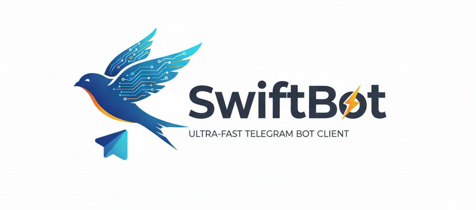

# SwiftBot - Telegram Bot Framework


[](https://www.python.org/)
[](LICENSE)
[](https://github.com/Arjun-M/SwiftBot/actions)

SwiftBot is an async Telegram bot framework built for simplicity and correctness. It offers typed decorators, composable filters, a middleware chain, persistent state (FSM) storage, HTTP/2 connection pooling with Telegram `Retry-After` compliance, and a full typed error hierarchy — with a complete test suite and CI.

## 🚀 Key Features

### Developer Experience
- **Telethon-Style Decorators**: Clean, intuitive `@client.on(Message(...))` syntax
- **Command Router with Trie**: O(m) command lookup for registered slash commands
- **Regex Pattern Matching**: Powerful message filtering
- **Composable Filters**: Exact-text, regex, and custom function filters
- **Type Hints**: Full IDE support
- **Rich Context Object**: Easy access to all update data, plus `ctx.reply()`, `ctx.answer()` shortcuts

### Robustness
- **Persistent FSM Storage**: State survives restarts — in-memory or JSON-file backends (pluggable via `BaseStorage`)
- **Rate-Limit Compliance**: Honors Telegram `Retry-After` on 429 responses, with circuit breaker
- **Typed Error Hierarchy**: Catch `ChatNotFound`, `TooManyRequests`, `Forbidden`, `InvalidToken`, etc.
- **Worker Pool with Backpressure**: Bounded concurrency and a dead-letter queue for failed updates
- **Webhook Server**: Secret-token verification, size limits, and health/metrics endpoints
- **File Support**: `InputFile` for local uploads, plus `get_file`/`download_file` helpers
- **HTTP/2 Connection Pooling**: Built on httpx with keep-alive connections
- **Centralized Exception Handling** and built-in metrics

## 📦 Installation

```bash
pip install swiftbot

# Or from GitHub
pip install git+https://github.com/Arjun-M/SwiftBot.git
```

## 🎯 Quick Start

```python
import asyncio
from swiftbot import SwiftBot
from swiftbot.types import Message
from swiftbot.middleware import Logger, RateLimiter

# Initialize bot
client = SwiftBot(
    token="YOUR_BOT_TOKEN",
    worker_pool_size=50,
    enable_http2=True
)

# Add cache-based middleware
client.use(Logger(level="INFO"))
client.use(RateLimiter(rate=10, per=60))

# Simple command handler
@client.on(Message(pattern=r"^/start"))
async def start(ctx):
    await ctx.reply("Hello! I'm SwiftBot 🚀")

# Run bot
asyncio.run(client.run())
```

## 📖 Documentation

### Client Initialization

```python
from swiftbot import SwiftBot

client = SwiftBot(
    token="YOUR_BOT_TOKEN",
    parse_mode="HTML",
    worker_pool_size=50,
    max_connections=100,
    timeout=30,
    enable_http2=True,
    enable_centralized_exceptions=True
)
```

### Event Handlers

```python
from swiftbot.types import Message, CallbackQuery

# Message handlers
@client.on(Message())  # All messages
@client.on(Message(text="hello"))  # Exact text match
@client.on(Message(pattern=r"^/start"))  # Regex pattern

# Callback query handlers
@client.on(CallbackQuery(data="button_1"))
@client.on(CallbackQuery(pattern=r"page_(\d+)"))
```

### Context Object

```python
@client.on(Message())
async def handler(ctx):
    # Message data
    ctx.text          # Message text
    ctx.user          # Sender user object
    ctx.chat          # Chat object
    ctx.args          # Command arguments
    ctx.match         # Regex match object

    # Reply methods
    await ctx.reply("Text")
    await ctx.edit("New text")
    await ctx.delete()
    await ctx.forward_to(chat_id)
```

### In-built Middleware

```python
from swiftbot.middleware import Logger, RateLimiter, Auth, AnalyticsCollector

# Logging (no external dependencies)
client.use(Logger(level="INFO", format="colored"))

# Rate limiting (in-memory cache)
client.use(RateLimiter(rate=10, per=60))

# Authentication (cache-based user management)
client.use(Auth(admin_list=[123, 456]))

# Analytics (cache-based metrics)
client.use(AnalyticsCollector(enable_real_time=True))
```

## 🏗️ Architecture

### Cache-Based Design
- **No External Dependencies** for core functionality
- **In-Memory Caching** for middleware data
- **Automatic Cleanup** of old cache entries
- **High Performance** without database overhead

### Connection Pool
- HTTP/2 multiplexing for 100+ concurrent streams
- Persistent keep-alive connections
- Automatic connection recycling
- Circuit breaker for fault tolerance

### Worker Pool
- Configurable worker count
- Bounded queue with backpressure
- Dead-letter queue for failed updates (exceptions preserved, retryable via `retry_dead_letters()`)
- Graceful drain on shutdown


## 🔧 Development

### Project Structure

```
swiftbot/
├── __init__.py           # Package initialization
├── client.py             # Main SwiftBot class
├── context.py            # Context object
├── types.py              # Event types
├── filters.py            # Filter system
├── storage.py            # FSM storage backends (memory + JSON file)
├── router.py             # Command router
├── webhook/              # aiohttp webhook server
├── exceptions/           # Exception handling
│   ├── base.py
│   ├── handlers.py
│   ├── api.py
│   └── telegram.py     # Typed Telegram error hierarchy
├── middleware/           # Logger, RateLimiter, Auth, AnalyticsCollector
│   ├── base.py
│   ├── logger.py
│   ├── rate_limiter.py
│   ├── auth.py
│   └── analytics.py
└── examples/             # Example bots
    └── basic_bot.py

Tests live in `tests/` and run via CI on every push.
```

## 🎯 Use Cases

- ✅ **Lightweight bots** without external dependencies
- ✅ **High-performance applications** needing speed
- ✅ **Serverless deployments** with minimal footprint
- ✅ **Development environments** with quick setup
- ✅ **Educational projects** learning bot development

## 🤝 Contributing

Contributions are welcome! Please feel free to submit a Pull Request.

## 📄 License

MIT License - Copyright (c) 2025 Arjun-M/SwiftBot

## 🙏 Acknowledgments

- Inspired by [Telethon](https://github.com/LonamiWebs/Telethon) Syntax
- Built on [httpx](https://www.python-httpx.org/) for HTTP/2

---
