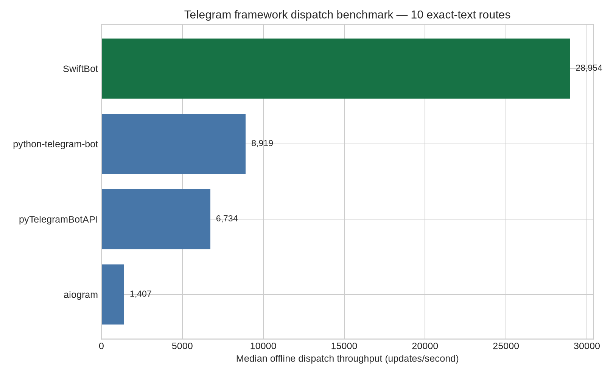
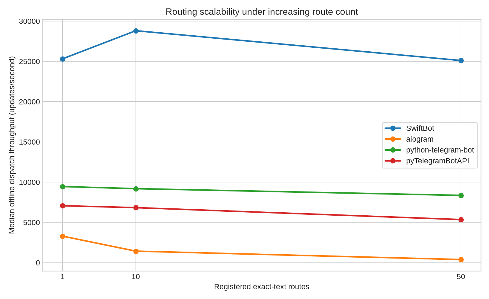
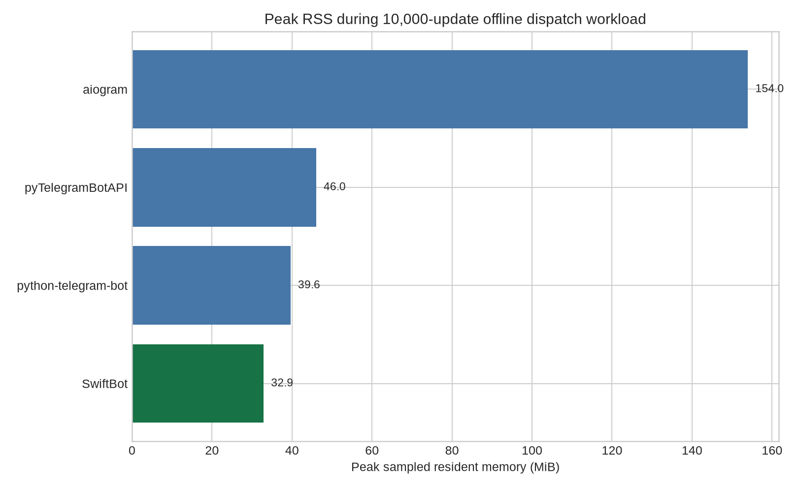
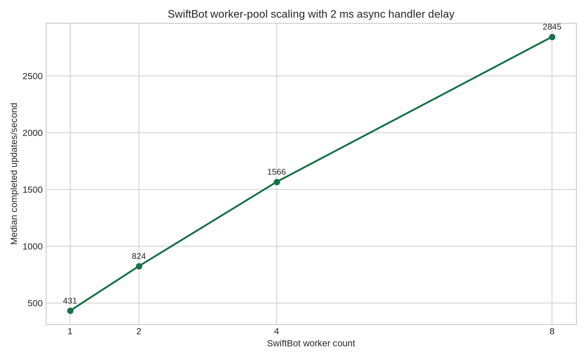

# SwiftBot Benchmark Report

**Assessment date:** 2026-08-16
**Runtime:** Python 3.12.3, Linux x86_64, 6 vCPUs, 3.8 GiB RAM

## Executive stance

> **SwiftBot is a strong candidate for greenfield, performance-sensitive asynchronous Telegram bots, but it should be adopted with a compatibility and load-test gate rather than treated as the safest mature default today.**

The latest controlled offline run gave SwiftBot the highest local routing throughput, lowest dispatch latency, lowest measured peak RSS, and smallest framework distribution in this matrix. Its worker pool also scaled usefully for asynchronous handlers and demonstrated bounded backpressure with no silent loss of accepted work. The main adoption risk is project maturity and ecosystem depth, not the measured local execution path.

## Frameworks and versions

| Framework | Version | Documented model |
|---|---:|---|
| SwiftBot | 1.6.3 | Async-first Telegram framework with typed decorators, filters, FSM, HTTP/2 pooling, worker pool, typed errors, and testing harness |
| aiogram | 3.30.0 | Fully asynchronous asyncio/aiohttp Telegram framework with typed models, filters, FSM, middleware, and webhooks |
| python-telegram-bot | 22.8 | Async pure-Python Telegram interface with high-level `telegram.ext` classes, polling, webhooks, and type annotations |
| pyTelegramBotAPI | 4.36.1 | Simple Telegram API library supporting synchronous and asynchronous APIs |

Sources: [SwiftBot PyPI][1], [SwiftBot GitHub][2], [aiogram PyPI][3], [python-telegram-bot PyPI][4], and [pyTelegramBotAPI PyPI][5].

## Offline dispatch results

The primary run used ten exact-text routes, a synthetic Telegram update stream, an async no-I/O handler, 250 warm-up updates, 5,000 updates per repeat, and seven repeats. No Telegram network call was made. Every framework routed the expected handler count correctly.

| Framework | Median throughput | Median latency/update | Relative throughput vs SwiftBot | Setup/build time | Correctness |
|---|---:|---:|---:|---:|---|
| **SwiftBot 1.6.3** | **28,954 updates/s** | **34.5 µs** | **1.00×** | **145.1 ms** | Pass |
| python-telegram-bot 22.8 | 8,919 updates/s | 112.1 µs | 0.308× | 218.2 ms | Pass |
| pyTelegramBotAPI 4.36.1 | 6,734 updates/s | 148.5 µs | 0.233× | 275.8 ms | Pass |
| aiogram 3.30.0 | 1,407 updates/s | 710.9 µs | 0.049× | 4,069.2 ms | Pass |

SwiftBot was approximately **3.25× faster than python-telegram-bot, 4.30× faster than pyTelegramBotAPI, and 20.6× faster than aiogram** in this narrow local routing workload. These numbers do not represent end-to-end production latency: Telegram network round trips, outbound API calls, business logic, databases, middleware, logging, and serialization can dominate real workloads.

The route-scaling sweep also favored SwiftBot. Its median throughput was 30,276 updates/s with one route, 29,341 with ten routes, and 25,095 with fifty routes. The comparison values are stored in `results/*_1routes.json`, `results/*_10routes.json`, and `results/*_50routes.json`.

## Memory and disk footprint

The memory test ran in a fresh process per framework with normal garbage collection enabled and streamed 10,000 updates. RSS includes the interpreter and dependencies; framework distribution size counts only files belonging to the named package.

| Framework | Peak RSS | Build RSS delta | Workload RSS delta | Package size | Site-packages size |
|---|---:|---:|---:|---:|---:|
| **SwiftBot** | **32.9 MiB** | **11.4 MiB** | **0.26 MiB** | **0.93 MiB** | 25.85 MiB |
| python-telegram-bot | 39.6 MiB | 18.4 MiB | 0.00 MiB | 6.75 MiB | **20.55 MiB** |
| pyTelegramBotAPI | 46.0 MiB | 24.8 MiB | 0.00 MiB | 4.44 MiB | 28.03 MiB |
| aiogram | 154.0 MiB | 131.1 MiB | 1.63 MiB | 5.76 MiB | 36.09 MiB |

SwiftBot had the lowest peak RSS in this run. The full site-packages footprint is not the smallest because dependency graphs differ. Memory results are deployment observations, not guarantees for arbitrary handler graphs.

## Worker pool, concurrency, and backpressure

SwiftBot’s verified default configuration is a 50-worker async worker pool, queue size 1,000, dead-letter handling enabled, and a five-second backpressure timeout. Its HTTP connection pool is configured for 100 maximum connections, 50 keepalive connections, and HTTP/2 enabled by default.

The pool test used a 2 ms asynchronous handler delay, 400 updates, queue size 100, and three repeats per worker count. All updates completed correctly.

| Workers | Median completed throughput | Completion |
|---:|---:|---|
| 1 | 437 updates/s | 400/400 in every repeat |
| 2 | 840 updates/s | 400/400 in every repeat |
| 4 | 1,567 updates/s | 400/400 in every repeat |
| 8 | **2,839 updates/s** | 400/400 in every repeat |

The eight-worker result was 6.5× the one-worker result, demonstrating useful scaling for I/O-like async handlers. The bounded queue test offered 20 updates to one worker with queue size two, 50 ms handler delay, and five-millisecond submit timeout. Four updates were accepted and completed, sixteen timed out, and no accepted work was silently lost.

The public `TestClient` harness routed all 5,100 expected handler calls correctly, but measured only 48.5 updates/s because its `drain()` implementation polls with a default 20 ms sleep. This is **test-harness overhead**, not SwiftBot core dispatch throughput; replacing polling with an awaitable queue-join mechanism would improve developer feedback.

## Real Telegram API test

A separate real-environment run used SwiftBot’s actual HTTP/2-enabled connection pool and called only `getMe`, `getChat`, and `getUpdates`. It did not send messages, modify webhooks, acknowledge updates, or call administrative methods. Bot identity and the requested chat ID were verified successfully; the username comparison was case-insensitive. The raw credential and private identifiers were excluded from the publishable result.

| Real API test | Result |
|---|---:|
| `getMe`, 20 calls | 20/20 successful; median **641.4 ms**, p95 676.6 ms |
| `getChat`, 5 calls | 5/5 successful; median **641.1 ms**, p95 659.9 ms |
| `getUpdates`, 5 calls | 5/5 successful; typical latency approximately 639 ms |
| Concurrent `getMe` at 1/2/4/8 | 1/1, 2/2, 4/4, 8/8 successful |
| RSS before/after build | 27.6 → 33.2 MiB; **5.6 MiB delta** |
| Connection-pool initialization | **0.20 ms** |
| Write methods called | **None** |

The real network round trip is roughly 640 ms, so framework-local differences are small compared with Telegram API latency. Full details are in [`REAL_TELEGRAM_REPORT.md`](REAL_TELEGRAM_REPORT.md), and the sanitized result is in `results/real_telegram_swiftbot_sanitized.json`.

## Advantages and risks

SwiftBot’s advantages are unusually strong local dispatch performance, low measured RSS, a small framework distribution, typed routing, persistent-state options, HTTP/2 pooling, retry handling, a built-in testing path, configurable worker concurrency, bounded backpressure, dead-letter handling, and a broad documented API surface.[1] [2]

The principal risk is maturity. SwiftBot is newer and less established than aiogram or python-telegram-bot. Before mission-critical adoption, the project should establish stable release tags, API compatibility guarantees, migration guidance, production soak tests, failure-injection tests, and more ecosystem evidence.

## Final decision matrix

| Use case | Recommendation |
|---|---|
| Greenfield async bot where speed, typed APIs, and local resource use matter | **Adopt with a load-test gate** |
| Constrained container or small deployment | **Strong candidate** |
| Mature ecosystem and conservative API risk are the top priority | **Prefer python-telegram-bot or aiogram** |
| CPU-bound handlers | **Use processes or external workers; async workers do not create CPU parallelism** |
| Mission-critical migration today | **Pilot first; do not blind-migrate** |

**Final stance:** SwiftBot has a credible technical performance advantage and is worth continuing as a high-performance Telegram framework. Its next priorities should be release maturity, compatibility guarantees, real production soak coverage, and a faster `TestClient` drain implementation, not merely additional speed claims.

## Reproduction

See [`README.md`](README.md) for pinned installation commands and test commands. Scripts are under `scripts/`, raw offline results under `results/`, and charts under `analysis/`. Never commit a token or an unsanitized real result.

## References

[1]: https://pypi.org/project/swiftbot/ "SwiftBot on PyPI"

[2]: https://github.com/Arjun-M/SwiftBot "SwiftBot on GitHub"

[3]: https://pypi.org/project/aiogram/ "aiogram on PyPI"

[4]: https://pypi.org/project/python-telegram-bot/ "python-telegram-bot on PyPI"

[5]: https://pypi.org/project/pyTelegramBotAPI/ "pyTelegramBotAPI on PyPI"
