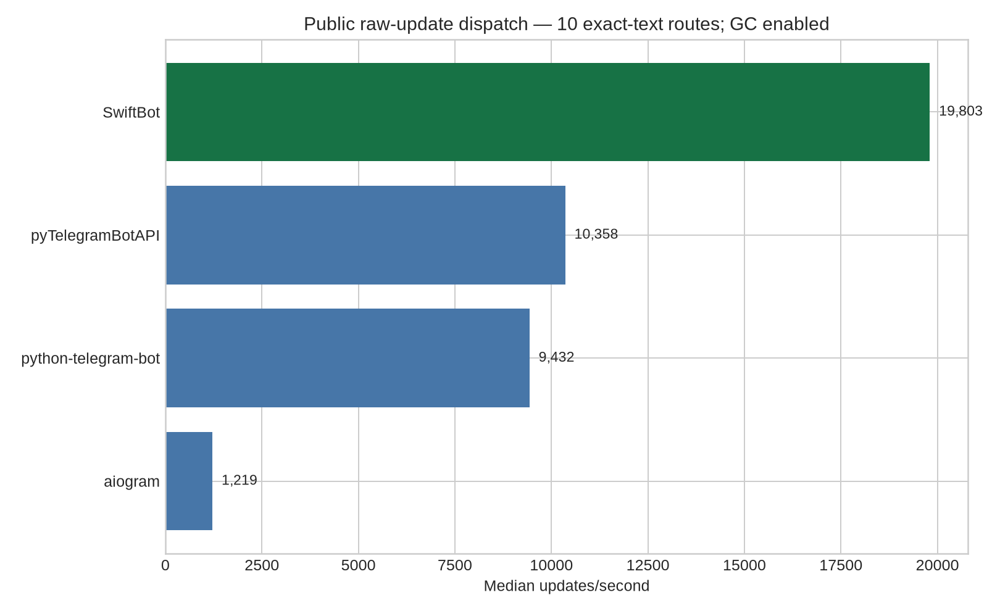
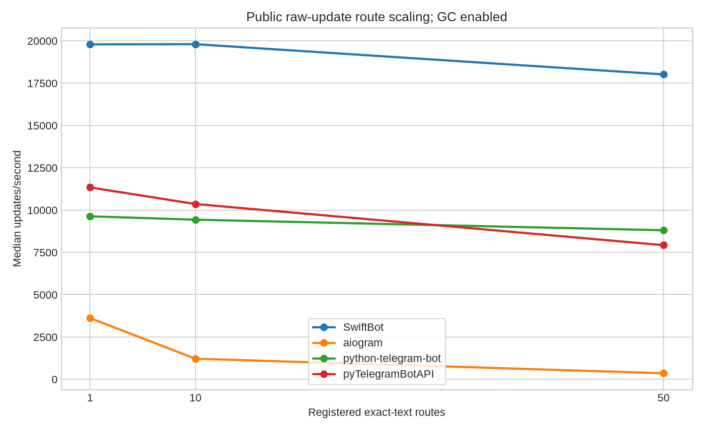
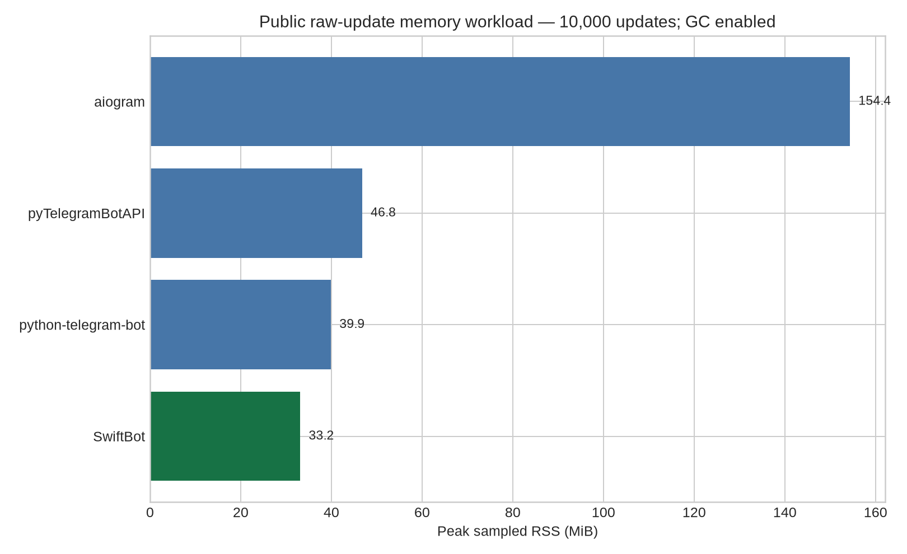

# SwiftBot Benchmark Report

**Assessment date:** 2026-08-16
**Runtime:** Python 3.12.3, Linux x86_64, 6 vCPUs, 3.8 GiB RAM

## Executive stance

> **SwiftBot has a measured low-overhead public update-processing path and a useful worker-pool design, but this benchmark is not evidence of universal end-to-end superiority.**

The earlier internal-path result has been replaced. The corrected benchmark uses public raw-update processing surfaces, exact-text matching, one logical worker, enabled garbage collection, identical synthetic Telegram-shaped updates, and correctness assertions.

SwiftBot leads the corrected local workload, but the conclusion is deliberately narrower: it is a promising option for performance-sensitive greenfield asynchronous bots. The safer production recommendation remains to pilot it against the application’s own middleware, persistence, webhook, error, and network workload before migration.

## Framework versions

| Framework | Version | Public path measured |
|---|---:|---|
| SwiftBot | 1.6.3 | `TestClient.send_updates` |
| aiogram | 3.30.0 | `Dispatcher.feed_raw_update` |
| python-telegram-bot | 22.8 | `Application.process_update` |
| pyTelegramBotAPI | 4.36.1 | `AsyncTeleBot.process_new_updates` |

Package identities and documented capabilities were checked against the official package pages and project documentation.[1] [2] [3] [4] [5]

## Corrected public raw-update benchmark

The benchmark uses ten exact-text routes, 100 warm-up updates, 2,000 measured updates per repeat, five repeats, one logical worker, enabled Python garbage collection, and no Telegram network calls. Every framework receives the same synthetic update shape and the same no-I/O async handler. Every run reached the expected 10,100 handler invocations.

| Framework | Median throughput | Median latency/update | Peak RSS | Correct |
|---|---:|---:|---:|---|
| **SwiftBot 1.6.3** | **19,803 updates/s** | **50.5 µs** | **33.2 MiB** | Yes |
| pyTelegramBotAPI 4.36.1 | 10,358 updates/s | 96.5 µs | 46.8 MiB | Yes |
| python-telegram-bot 22.8 | 9,432 updates/s | 106.0 µs | 39.9 MiB | Yes |
| aiogram 3.30.0 | 1,219 updates/s | 820.4 µs | 154.4 MiB | Yes |

SwiftBot measured approximately 1.91× the pyTelegramBotAPI throughput, 2.10× python-telegram-bot, and 16.24× aiogram in this specific public raw-update workload. These ratios are **not universal framework speed claims**. The adapters are public and more comparable than the previous version, but their internals still differ: some frameworks construct typed update objects, perform validation, or run different middleware and scheduling paths.



## Fairness rules and limitations

The benchmark normalizes the input update structure, route count, exact-text matching intent, handler body, worker count, garbage-collection mode, warm-up, repeats, and correctness assertion. SwiftBot uses the public `TestClient.send_updates()` path, aiogram uses `Dispatcher.feed_raw_update`, python-telegram-bot uses `Application.process_update` after `Update.de_json`, and pyTelegramBotAPI uses `AsyncTeleBot.process_new_updates` after its update conversion.

These calls are public and representative, but they are not implementation-identical. A framework that constructs richer typed models is doing more work inside the measured path. The results therefore answer a practical question—how these installed versions process a Telegram-shaped raw update through their public offline APIs—not an abstract question about which architecture is intrinsically fastest.

The test excludes Telegram network latency, webhook servers, database and Redis calls, application business logic, large media payloads, production middleware stacks, logging, retries, and long-duration stability. The real Telegram test is reported separately and is not combined with local dispatch throughput.

## Route scaling

The corrected sweep uses the same public paths with one, ten, and fifty exact-text routes. Results are stored in `results/public/` and summarized in `reports/scaling.json`.



## Memory and resource footprint

The resource benchmark uses a fresh process per framework, normal garbage collection, ten routes, 10,000 updates, and 100-update batches through the same public raw-update surfaces.

| Framework | Peak RSS | Build RSS delta | Workload RSS delta | Correct |
|---|---:|---:|---:|---|
| **SwiftBot** | **33.2 MiB** | **11.1 MiB** | **0.63 MiB** | Yes |
| python-telegram-bot | 39.9 MiB | 18.3 MiB | 0.25 MiB | Yes |
| pyTelegramBotAPI | 46.8 MiB | 24.7 MiB | 0.77 MiB | Yes |
| aiogram | 154.4 MiB | 131.1 MiB | 1.98 MiB | Yes |

SwiftBot had the lowest peak RSS in this run. These are process-level observations for this workload, not guarantees for arbitrary bots. RSS includes the interpreter and dependency graph.



## Worker pool and backpressure

The SwiftBot worker-pool test uses a 2 ms asynchronous handler delay, 400 updates, queue size 100, and three repeats per worker count. All updates completed correctly in every repeat.

| Workers | Median throughput | Completion |
|---:|---:|---:|
| 1 | 438 updates/s | 400/400 |
| 2 | 840 updates/s | 400/400 |
| 4 | 1,580 updates/s | 400/400 |
| 8 | **2,804 updates/s** | 400/400 |

The bounded-queue test offered 20 updates to one worker with queue size two, 50 ms handler delay, and a five-millisecond submit timeout. Four updates were accepted and completed; sixteen timed out; no accepted work was silently lost.

The default pool configuration is 50 workers, queue size 1,000, dead-letter handling enabled, and a five-second backpressure timeout. Async workers improve I/O concurrency but do not create CPU parallelism for CPU-bound handlers.

## TestClient correction

The public `TestClient.drain()` implementation previously polled `queue.empty()` with a default 20 ms sleep. That could return too early when a worker had taken a task but had not finished its handler, and it made the public harness look artificially slow. It now uses `asyncio.Queue.join()`, which waits for every submitted task to call `queue.task_done()`. Regression tests cover both a slow in-flight handler and a multi-update batch.

## Real Telegram API smoke test

The separate real-environment test is intentionally read-only. It calls only `getMe`, `getChat`, and `getUpdates`; it does not send messages, modify webhooks, acknowledge updates, or call administrative methods. The verified run recorded approximately 641 ms median latency for both `getMe` and `getChat`, successful concurrent read calls, and no write methods. Real network latency dominates local dispatch differences, so this result is not used to rank framework speed.

The real runner supports `--sanitize`, which removes bot and chat identifiers before writing a publishable result. Keep tokens outside the repository and write raw output only to the ignored `results/raw/` directory.

## Recommendation

SwiftBot should be presented as a **promising low-overhead async Telegram framework with a configurable worker pool**, not as a universally 3–20× faster replacement. The corrected public-path result supports further development and targeted pilots. Before calling it production-ready for mission-critical workloads, the project should add long-running soak tests, webhook benchmarks, persistence and Redis tests, middleware-heavy cases, retry/error tests, and compatibility guarantees.

## Reproduction

Install the pinned frameworks in isolated environments:

```bash
python3 -m venv venv-swiftbot
python3 -m venv venv-aiogram
python3 -m venv venv-ptb
python3 -m venv venv-telebot

venv-swiftbot/bin/python -m pip install swiftbot==1.6.3
venv-aiogram/bin/python -m pip install aiogram==3.30.0
venv-ptb/bin/python -m pip install python-telegram-bot==22.8
venv-telebot/bin/python -m pip install pyTelegramBotAPI==4.36.1
```

Run the primary benchmark from the repository root:

```bash
mkdir -p tests/benchmark/results/raw

PYTHONPATH=. venv-swiftbot/bin/python tests/benchmark/benchmark_dispatch.py swiftbot --routes 10 --iterations 2000 --warmup 100 --repeats 5 --output tests/benchmark/results/raw/swiftbot.json
venv-aiogram/bin/python tests/benchmark/benchmark_dispatch.py aiogram --routes 10 --iterations 2000 --warmup 100 --repeats 5 --output tests/benchmark/results/raw/aiogram.json
venv-ptb/bin/python tests/benchmark/benchmark_dispatch.py ptb --routes 10 --iterations 2000 --warmup 100 --repeats 5 --output tests/benchmark/results/raw/ptb.json
venv-telebot/bin/python tests/benchmark/benchmark_dispatch.py telebot --routes 10 --iterations 2000 --warmup 100 --repeats 5 --output tests/benchmark/results/raw/telebot.json
```

Run memory, worker-pool, and report generation:

```bash
PYTHONPATH=. venv-swiftbot/bin/python tests/benchmark/benchmark_memory.py swiftbot --routes 10 --updates 10000 --batch-size 100 --output tests/benchmark/results/raw/memory_swiftbot.json
PYTHONPATH=. venv-swiftbot/bin/python tests/benchmark/benchmark_pool.py --updates 400 --delay 0.002 --queue-size 100 --repeats 3 --backpressure-updates 20 --backpressure-delay 0.05 --backpressure-timeout 0.005 --output tests/benchmark/results/raw/pool.json
python3 tests/benchmark/analyze.py
```

Run the read-only real API test:

```bash
export TELEGRAM_TOKEN_FILE=/secure/location/Env.txt
PYTHONPATH=. venv-swiftbot/bin/python tests/benchmark/benchmark_real_api.py \
  --token-file "$TELEGRAM_TOKEN_FILE" \
  --chat-id "$TELEGRAM_CHAT_ID" \
  --expected-username "$TELEGRAM_EXPECTED_USERNAME" \
  --output tests/benchmark/results/raw/real_telegram.json
```

Never commit a token or unsanitized real response. Revoke any token that has been exposed.

## References

[1]: https://pypi.org/project/swiftbot/ "SwiftBot on PyPI"

[2]: https://github.com/Arjun-M/SwiftBot "SwiftBot on GitHub"

[3]: https://pypi.org/project/aiogram/ "aiogram on PyPI"

[4]: https://pypi.org/project/python-telegram-bot/ "python-telegram-bot on PyPI"

[5]: https://pypi.org/project/pyTelegramBotAPI/ "pyTelegramBotAPI on PyPI"
